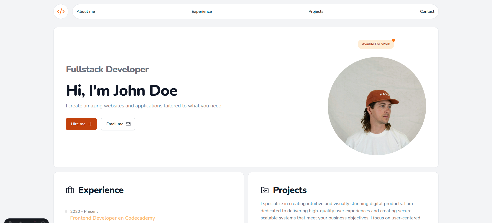

# Web Portfolio #1

```sh
git clone https://github.com/FrankBV94/portfolio_dev_1.git
cd portfolio_dev_1
npm install
npm run dev
```



## 🚀 Project Structure

Inside this project, you'll see the following folders and files:

```text
/
├── public/
│   └── favicon.svg
├── src/
│   ├── assets/
│   │   └── screenshot.png
│   │   └── profile.jpg
│   ├── components/
│   │   └── Icons/
│   │   │   └── CodeIcon.astro
│   │   │   └── ExperienceIcon.astro
│   │   │   └── MailIcon.astro
│   │   │   └── PlusIcon.astro
│   │   │   └── ProjectIcon.astro
│   │   └── ExperienceItem.astro
│   │   └── Footer.astro
│   │   └── Header.astro
│   │   └── Section.astro
│   ├── layouts/
│   │   └── Layout.astro
│   └── pages/
│       └── Sections/
│       │   └── Experience.astro
│       │   └── Main.astro
│       │   └── Projects.astro
│       └── index.astro
└── package.json
```

## 👀 Want to see more?

Feel free to check [my repository](https://github.com/FrankBV94?tab=repositories).
